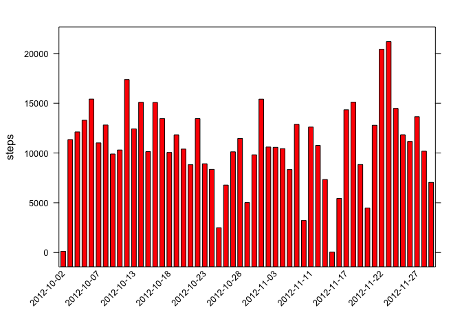
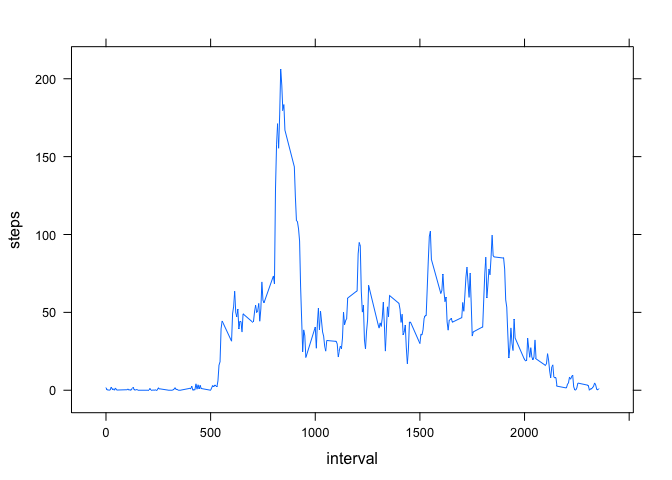
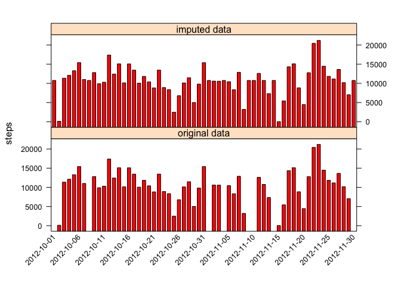
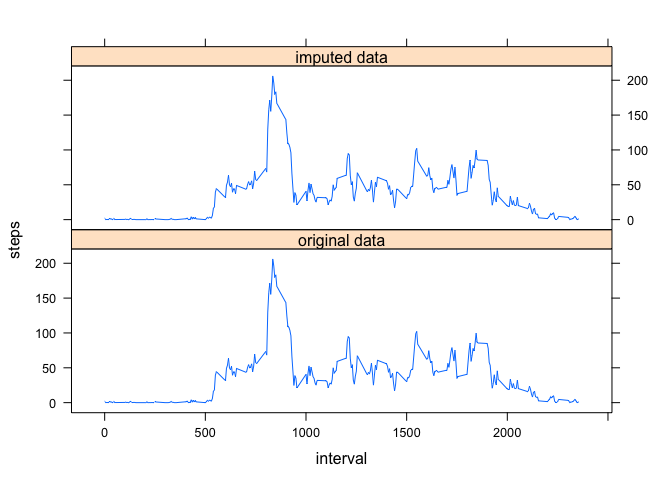
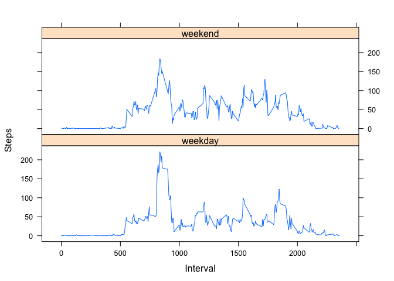

# Reproducible Research: Peer Assessment 1


## Loading and preprocessing the data
The firs step is to load the data.  
As the datafile is zipped, *unz* function is used to unzip the file 'on the fly' before reading it with *read.csv*.  
Readed data is assigned to *data* variable.

```r
data<-read.csv(unz('activity.zip', as.character('activity.csv')), header=TRUE, quote="\"", stringsAsFactors=FALSE)
```


## What is mean total number of steps taken per day?
Data has to be aggregated by day for obtaining the mean value.  
First we present the histogram with the aggregated data.


```r
data_byday<-aggregate(steps~date,data,sum)
n_labels<-seq(1,nrow(data_byday),5)
text_labels<-data_byday$date[n_labels]
barchart(steps~date,data_byday,scales=list(x=list(at=n_labels,labels=text_labels,rot=45,cex=0.8)),col='red')
```

 

Mean and median values are then easily calculated.

```r
mean(data_byday$steps)
```

```
## [1] 10766.19
```

```r
median(data_byday$steps)
```

```
## [1] 10765
```

## What is the average daily activity pattern?
In order to calculate the daily activity pattern, it is needed to aggregate the data in function of the 5-minute intervals. Then, we can show the obtained time-series.

```r
data_byinterval<-aggregate(steps~interval,data,mean)
xyplot(steps~interval,data_byinterval,type='l')
```

 

The 5-minute interval containing, in average across all days, the maximum number of steps is given by:

```r
data_byinterval[which.max(data_byinterval$steps),1]
```

```
## [1] 835
```

## Imputing missing values
The total number of *NA* values in the data is:

```r
steps_NA<-is.na(data$steps)
sum(steps_NA)
```

```
## [1] 2304
```
We are going to fill the missing values with the mean value across all days corresponging to the same 5-minute interval.

```r
corrected_data<-data
for (i in which(steps_NA)){
  corrected_data[i,1]<-data_byinterval$steps[which(data_byinterval$interval==data[i,3])]
}
```

After filling the missing values, we want to compare with the original data.   
Herewith there are presented the histograms with the total number of steps in one day for the original and the filled data.


```r
corrected_data_byday<-aggregate(steps~date,corrected_data,sum)
n_labels<-seq(1,nrow(corrected_data_byday),5)
text_labels<-corrected_data_byday$date[n_labels]
draw_data_byday<-rbind(cbind(data_byday,imputed='original data'),cbind(corrected_data_byday,imputed='imputed data'))
barchart(steps~date|imputed,draw_data_byday,scales=list(x=list(at=n_labels,labels=text_labels,rot=45,cex=0.8)),col='red',layout=c(1,2))
```

 

The mean and median values for imputed data are:

```r
mean(corrected_data_byday$steps)
```

```
## [1] 10766.19
```

```r
median(corrected_data_byday$steps)
```

```
## [1] 10766.19
```

It can be seen that there are not important differences with the results obtained with the original data.  
The activity pattern is compared in the next plots.

```r
corrected_data_byinterval<-aggregate(steps~interval,corrected_data,mean)
draw_data_byinterval<-rbind(cbind(data_byinterval,imputed='original data'),cbind(corrected_data_byinterval,imputed='imputed data'))
xyplot(steps~interval|imputed,draw_data_byinterval,type='l',layout=c(1,2))
```

 

And finally, the 5-minute interval with the maximum number of steps remains the same.

```r
corrected_data_byinterval[which.max(corrected_data_byinterval$steps),1]
```

```
## [1] 835
```


## Are there differences in activity patterns between weekdays and weekends?
First we have to obtain the weekdays from data and classify in function of *weekday* and *weekend*.

```r
weekdays<-weekdays(as.POSIXct(corrected_data$date))
weekday<-c('lunes','martes','miercoles','jueves','viernes')
corrected_data<-cbind(corrected_data,"Weekday"=weekdays %in% weekday)
corrected_data_byinterval_weekdays<-aggregate(steps~interval,subset(corrected_data,corrected_data$Weekday),mean)
corrected_data_byinterval_weekends<-aggregate(steps~interval,subset(corrected_data,!corrected_data$Weekday),mean)
```
A new *dataframe* is then constructed to make a panelplot showing *weekday* and *weekend* average values of steps.

```r
corrected_data_byinterval_weekdays<-cbind(corrected_data_byinterval_weekdays,'day'=c('weekday'))
corrected_data_byinterval_weekends<-cbind(corrected_data_byinterval_weekends,'day'=c('weekend'))
corrected_data_byinterval<-rbind(corrected_data_byinterval_weekdays,corrected_data_byinterval_weekends)
xyplot(steps~interval|day,corrected_data_byinterval,type='l',xlab = 'Interval',ylab='Steps',layout=c(1,2))
```

 

It can be seen that both plots show a peak of activity (due probably to some sport practice in the morning). Moreover, there is more activity in weekend than in weekdays what can suggest a sedentary work.
